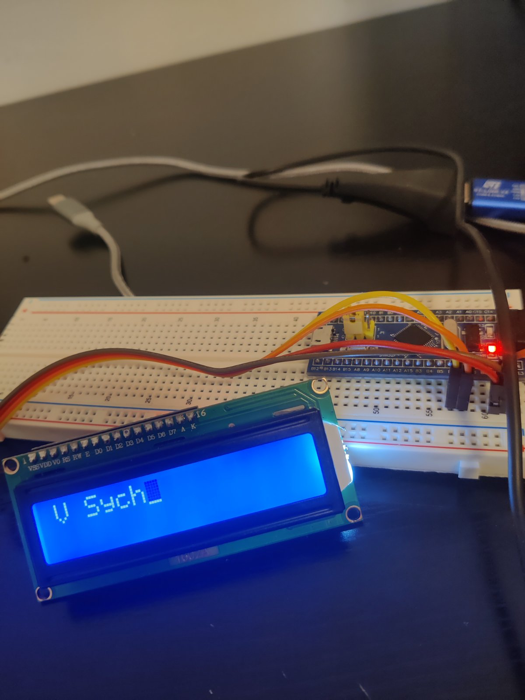
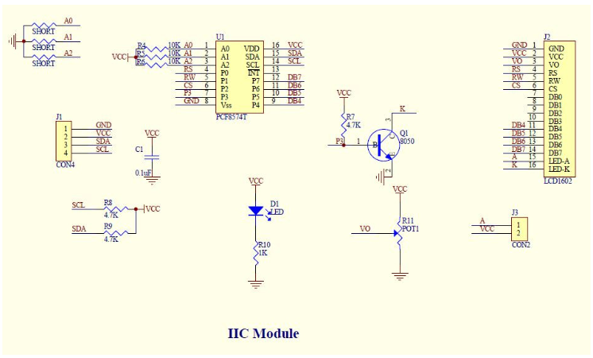

STM32 F103 + I2C LCD1602

| PCF8574T | LCD |
| ---      | --- |
| P0       | RS - data/instruction 1/0 |
| P1       | RW - read/write 1/0 |
| P2       | EN - enable 1 |
| P3       | BL - led backlight on/off 1/0 |
| P4       | D4 - 4bit mode D4-D7 |
| P5       | D5 |
| P6       | D6 |
| P7       | D7 |
 
I2C-byte: D7 D6 D5 D4 BL EN RW RS

https://www.ti.com/lit/ds/symlink/pcf8574.pdf
https://www.sparkfun.com/datasheets/LCD/HD44780.pdf

